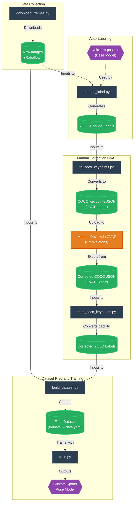
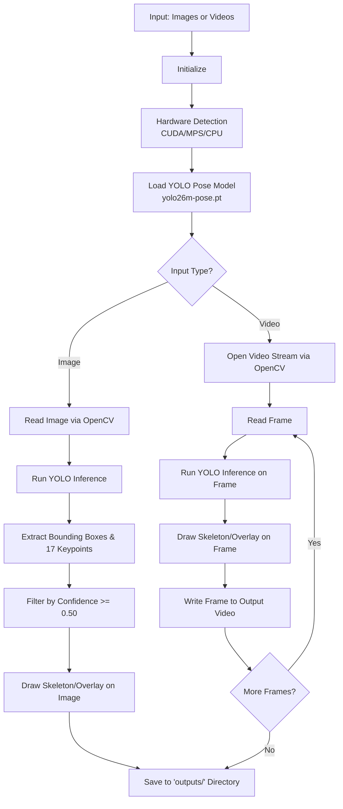

# AI Basketball Coach — Pose Estimation-Powered Shooting Analysis & Feedback

A YOLO-based system for pose-driven biomechanical analysis of basketball shooting technique, turning raw video into measurable technique insights and interactive, LLM-generated feedback.

Basketball shooting analysis has traditionally relied on manual video review, making consistent, quantitative technique assessment difficult. This project investigates a YOLO-based pipeline for extracting human pose data from basketball shooting footage and converting body-joint keypoints into reliable, sport-specific technique metrics.

This repository implements the current, general-purpose pose estimation core of that pipeline: high-precision 2D human pose estimation using **Ultralytics YOLO-Pose**, with automatic GPU/MPS hardware acceleration, that detects and tracks 17 COCO body keypoints across images and video.

---

## Team

**B.Tech CSE, VIT Chennai**

| Name | Registration No. |
| :--- | :--- |
| Prodhosh VS | 25BCE5129 |
| Gowreesh V T | 25BCE1760 |
| Sri Saidhakshini | 25BCE1685 |

**Under the guidance of:** Saraswathi D, Associate Professor, SCOPE

---

## Challenges & Research Gap

Existing studies demonstrate the feasibility of pose-based basketball analysis, but robust end-to-end technique assessment remains an open problem:

- **Key Challenges**
  - Reliable keypoint detection across varying camera angles, lighting, and motion blur.
  - Distinguishing meaningful technique deviations from normal differences between players.
- **Research Gap**
  - Limited availability of basketball-specific annotated pose data for shooting analysis.

---

## Project Objectives

Build an end-to-end system that captures basketball shooting footage, extracts pose data, quantifies shooting technique, and delivers actionable, interpretable feedback to the player — closing the gap between raw pose estimation and coach-quality analysis.

---

## Proposed Methodology & System Architecture

The full "Diagnosis Engine" pipeline is designed around five stages:

1. **Video Processing** — Capture and preprocess basketball shooting footage using OpenCV.
2. **Pose Estimation** — Extract 17 body keypoints using YOLO-Pose (this repository).
3. **Feature Extraction & Analysis** — Compute biomechanical and temporal features and identify technique deviations.
4. **AI Insight Generation** — Convert structured analysis into interpretable feedback using an LLM API.
5. **Interactive Feedback** — Deliver textual and voice-based feedback through a web application using ElevenLabs.

### Custom Sports Pose Model Pipeline

Beyond off-the-shelf inference, [`sports_pipeline/`](sports_pipeline) contains the data pipeline used to fine-tune a custom, sports-specific pose model — from raw frame collection through pseudo-labeling, manual correction in CVAT, and final dataset assembly/training:



### Inference Pipeline (`main.py`)



---

## Features

- **Default Model (`yolo26m-pose.pt`)**: High-performance Medium architecture (~24.2M parameters, 85.5 GFLOPs) offering fast inference and accurate joint localization on complex poses (like Warrior and Boat poses).
- **Hardware Acceleration**: Automatic device detection supporting **Apple Silicon (MPS)**, **NVIDIA (CUDA)**, and fallback CPU.
- **Batch Processing**: Automatically scans and processes all images and videos from designated input folders.
- **Visual Annotations & Logging**: Outputs rendered skeleton diagrams, bounding boxes, and prints keypoint coordinates with confidence scores.
- **Custom Sports Dataset Pipeline**: End-to-end tooling ([`sports_pipeline/`](sports_pipeline)) to collect, pseudo-label, manually correct, and train a basketball-specific pose model.

---

## 17 COCO Keypoints

The model predicts 17 anatomical keypoints across the human body:

| Index | Keypoint Name | Index | Keypoint Name |
| :--- | :--- | :--- | :--- |
| `0` | Nose | `9` | Left Wrist |
| `1` | Left Eye | `10` | Right Wrist |
| `2` | Right Eye | `11` | Left Hip |
| `3` | Left Ear | `12` | Right Hip |
| `4` | Right Ear | `13` | Left Knee |
| `5` | Left Shoulder | `14` | Right Knee |
| `6` | Right Shoulder | `15` | Left Ankle |
| `7` | Left Elbow | `16` | Right Ankle |
| `8` | Right Elbow | | |

---

## Project Structure

```
pose-estimation/
├── images/             # Input images (.png, .jpg, .jpeg, .webp)
├── videos/             # Input videos (.mp4, .avi, .mkv, .mov)
├── outputs/            # Output annotated images & videos
├── sports_pipeline/    # Custom dataset collection, labeling & training pipeline
├── main.py             # Main inference & processing script
├── requirements.txt    # Project dependencies
├── yolo26m-pose.pt     # Default pose model weights (Medium)
└── README.md           # Documentation
```

---

## Installation & Setup

1. **Clone the repository**:
   ```bash
   git clone https://github.com/Innovative-Design-Project/pose-estimation.git
   cd pose-estimation
   ```

2. **Create and activate a virtual environment**:
   ```bash
   python3 -m venv .venv
   source .venv/bin/activate    # On macOS / Linux
   # .venv\Scripts\activate     # On Windows
   ```

3. **Install dependencies**:
   ```bash
   pip install -r requirements.txt
   ```

---

## Usage

### 1. Default Run (Processes all files in `images/` and `videos/`)
Place any test images in `images/` or videos in `videos/`, then run:
```bash
python main.py
```

### 2. Custom Parameters & Options
You can customize the model, input/output folders, image resolution, and device:
```bash
# Run with high resolution for extra precision on wide shots
python main.py --imgsz 1280

# Specify custom folders
python main.py --images-dir my_images --output-dir my_outputs

# Force a specific hardware device
python main.py --device mps     # Apple Silicon
python main.py --device cuda    # NVIDIA GPU
python main.py --device cpu     # CPU
```

---

## Model Benchmark

| Model | Parameters | GFLOPs | Accuracy on Complex Poses | Recommended For |
| :--- | :--- | :--- | :--- | :--- |
| **`yolo26n-pose`** | ~3.68 M | 10.4 | Low (Struggles with wide lunges) | Edge / IoT Devices |
| **`yolo26m-pose`** | ~24.2 M | 85.5 | High (Good balance) | Real-time high-FPS video |
| **`yolo11x-pose`** | **~58.8 M** | **204.2** | **Flawless (State-of-the-Art)** | **Studio, athletic & yoga analysis** |

---

## Roadmap

- [x] Core pose estimation pipeline (image & video, 17 COCO keypoints)
- [x] Custom sports dataset collection, pseudo-labeling & CVAT correction pipeline
- [ ] Basketball-specific biomechanical feature extraction & technique scoring
- [ ] LLM-based feedback generation
- [ ] Web application with interactive voice feedback (ElevenLabs)

---

## License

This project is licensed under the MIT License.
